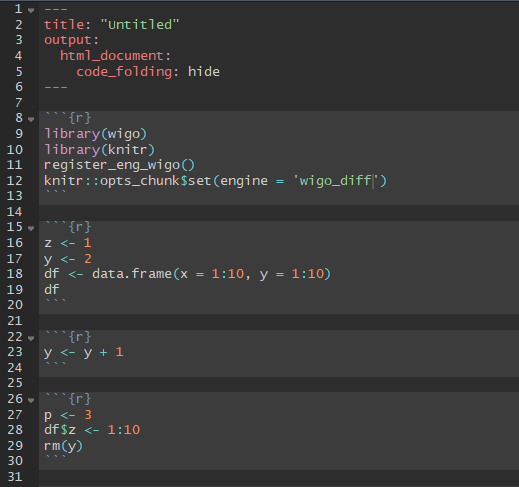
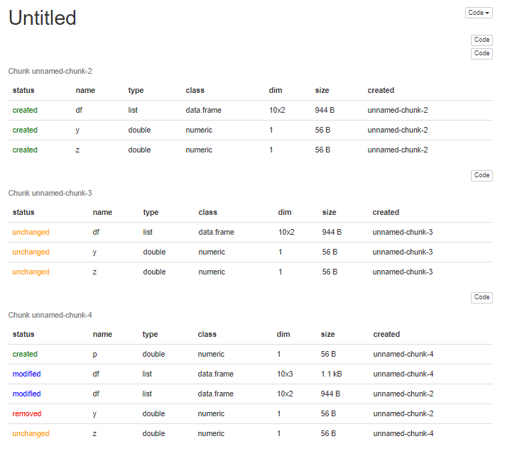
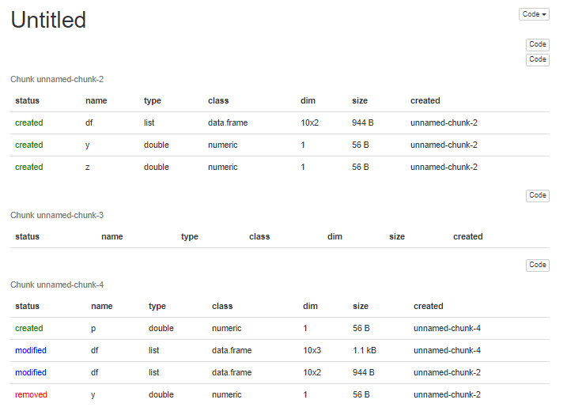

# wigo

<!-- badges: start -->
[](https://www.tidyverse.org/lifecycle/#experimental)
<!-- badges: end -->

The goal of `wigo` is to make it easier to understand how an RMarkdown is generating its output by toggling the knit engine. `wigo` will help you understand *w*hat *i*s *g*oing *o*n in an RMarkdown document by output a table explaining the knitting state and key changes. 

Specifically, instead of normal chunk output, `wigo` output a table explaining the state containing columns for each object in the enviornment and describing its:

- status (created, modified, removed)
- name
- type
- class
- dimensions (rows x columns for dataframes and `length` otherwise)
- object size
- name of chunk in which variable was created or last modified

A new row is added to this table either when a new object is added to the environment or when the dimensions of a current object change. Currently, the actual contents of objects are not inspected.

## Installation

You can install the development version of `wigo` from GitHub with:

``` r
remotes::install_git('emily_riederer/wigo')
```

Note that this package is *extremely* experimental, untested, and subject to change.

## Example

You can toggle the language engine of your RMarkdown document to `wigo` by adding this to the set-up chunk of your RMarkdown:

```
library(wigo)
register_eng_wigo()
knitr::opts_chunk$set(engine = 'wigo')
```

to see a full description of the environment and any changes at each point in time, or

```
library(wigo)
register_eng_wigo()
knitr::opts_chunk$set(engine = 'wigo_diff')
```

to see only the environment diff. 

By doing so, you can input such as:



to output like:



or like this with the `wigo_diff` engine:



# Assumptions & Limitations

- `wigo` assumes all chunks in your RMarkdown are currently R chunk, and it requires that you globally set the rendering engine to `wigo` instead. Currently, the underlying logic will not work particularly well for a single chunk
- For a given variable name, `wigo` detects changes to to an object's class, type, size, or dimensions but not its underlying contents. For example, in the image above, no changes are detected for `y` after we do the computation `y <- y+1` because this does not meaningfully change any of elements listed above although it clearly changes the value
- Additionally, `wigo` currently works exclusively for HTML output
